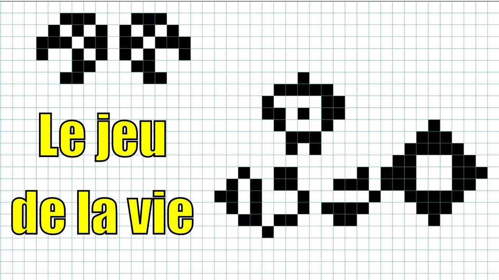
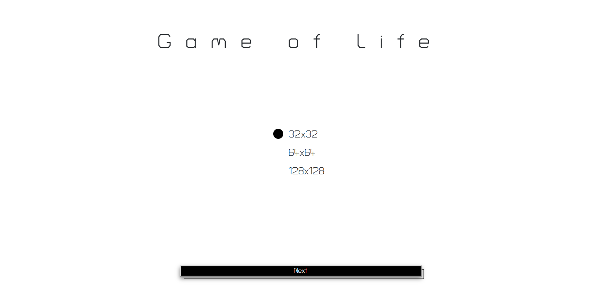
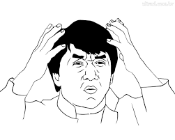

# **WORKSHOP: JEU DE LA VIE.**

<p align="center">
	
</p>

## Bonjour et bienvenue sur notre Workshop. Ensemble, nous allons apprendre a créer le "Jeu de la Vie" en javascript sans framework.

Workshop réalisé par :
*   [Sébastien Chantrie](https://github.com/sebastienchantrie)
*   [Buono Enzo](https://github.com/Enzob09)


# LE "JEU DE LA VIE" ? KÉSAKO ?
<p align="center">
  
  
</p>

Il s'agit d'un [_automate cellulaire_](https://fr.wikipedia.org/wiki/Automate_cellulaire) imaginé par [_John Horton Conway_](https://fr.wikipedia.org/wiki/John_Horton_Conway) en 1970. Il est reconnu comme avoir créé l'automate cellulaire le plus célèbre : le Jeu de la Vie Turing-complet.

Le Jeu de la Vie se voit plus comme un jeu au sens mathématique que ludique. Bien qu'il n'est pas décrit par la théorie des jeux, certains le définissent comme un **_« jeu à zéro joueur »_**.

# RÈGLES DU JEU
Avant de commencer, précisons que le Jeu de la Vie n’est pas vraiment un jeu puisqu'il ne nécessite aucun joueur. C'est un automate cellulaire, un modèle où chaque état conduit mécaniquement à l’état suivant à partir de règles pré-établies.

Le « Jeu » se déroule sur une grille à deux dimensions, théoriquement infinie (mais de longueur et de largeur finies et plus ou moins grandes dans la pratique), dont les cases (cellules) peuvent prendre deux états distincts : « vivante » ou « morte ».

À chaque étape, l’évolution d’une cellule est entièrement déterminée par l’état de ses huit voisines de la façon suivante :
*	Une cellule morte possédant exactement trois voisines vivantes devient vivante.
*	Une cellule vivante possédant deux ou trois voisines vivantes le reste, sinon elle meurt.

## Ce que nous allons voir lors de la réalisation de ce Workshop
1.   Tableau Multi Dimensionnel
2.   Conception d'un algorithme mathématique
3.   Boucles et conditions
4.   Manipulation du DOM
5.   Passage de paramètres à des fonctions

# FINI LE BLABLA, LET'S GO !

<p align="center">
  
</p>

### I. Première étape, clonez le repo sur votre ordinateur.

Dans ce dossier, vous trouverez les éléments suivants:
* Un fichier index.html
* Un fichier style.css
* Un fichier script.js

Ces fichiers seront **indispensables** pour la suite du Workshop. Le fichier _index.html_ contient tous les éléments définis par une classe, le fichier _style.css_ contient le style visuel pour l'html et
le fichier _script.js_ sera le fichier sur lequel nous travaillerons.

##### Rem. : Cet exercice n'est pas en responsive. Rien ne vous empêche de le rendre en responsive par vous-même.

##### Rem2. : Veillez à bien nommer vos variables de la même manière que cet exercice afin de ne pas rencontrer de problèmes.

### II. Regardons la structure du projet.

En ouvrant l'index.html dans votre navigateur, vous devriez tomber sur cette page :
<p align="center">
  
</p>

Voici le résultat. Je suis sûr que vous vous êtes hâtés sur le bouton "NEXT" ! Hélas, pour vous, rien ne se passe. Nous allons donc commencer par créer l'affichage du tableau dans lequel se déroulera notre Jeu de la Vie.

### III. Un peu de code ?!

Nous allons devoir créer un **tableau Multi-dimensionnel** d'une taille égale à celle proposée sur la page d'accueil, en somme 32x32, 64x64 et 128x128.
Pour ce faire, nous allons avoir besoin d'une variable afin de stocker le resultat des input radio. Nous allons déclarer cette variable en globale et sans valeurs pour le moment parce que nous devrons l'utiliser à nouveau plus tard...

Une variable déclarée en dehors d'une fonction devient **GLOBALE** .
Une variable globale a **_une portée globale_** : tous les scripts et toutes les fonctions d'une page Web peuvent y accéder.
Par convention, nous allons la placer tout en haut du script.

```JS
// Déclarer la variable
let  nbtab;
```
```JS
    btnclick.addEventListener("click", () => {
		let  tbl  =  document.createElement("table");
		let  tblBody  =  document.createElement("tbody");
		// On verifie quel input est selectionné et on stock la réponse dans la variable nbtab
		if (document.getElementById('32').checked) nbtab  =  32;
		else  if (document.getElementById('64').checked) nbtab  =  64;
		else  nbtab  =  128;
		// Ensuite , on crée un tableau de la taille de nbtab
		for (let  i  =  0; i  <  nbtab; i++) {
			let  row  =  document.createElement("tr");
			for (let  j  =  0; j  <  nbtab; j++) {
			let  cell  =  document.createElement("td");
			// Sur chaques céllule on ajoute la classe false par défaut , ainsi qu'un ID
			cell.classList.add('false');
			cell.id  =  `cell-${i}-${j}`
			if (nbtab  ===  32) {
			cell.classList.add('mini');
			bodytab.classList.add('col-lg-8');
			bodytab.classList.add('littlemargin');
		}
		else  if (nbtab  ===  64) {
			cell.classList.add('middle');
			bodytab.classList.add('col-lg-6');
			bodytab.classList.add('middlemargin');
		} else {
			cell.classList.add("big");
			bodytab.classList.add('col-lg-8');
			bodytab.classList.add('bigmargin');
		}
		row.appendChild(cell); // ***
		}
		tblBody.appendChild(row);
		let  move  =  document.getElementById('move');
		move.classList.add('move');
		tbl.appendChild(tblBody);
		bodytab.appendChild(tbl);
		tbl.setAttribute("border", "2");
		}
	});
```
<p align="center">
  
</p>

Si vous avez bien noté ce bout de code, vous devriez maintenant pouvoir cliquer sur le bouton et apercevoir un tableau de la taille de votre sélection.

L'affichage du tableau est réalisé mais il ne se passe pas encore grand chose dans notre jeu. Par défaut, le tableau est généré avec toutes les cellules mortes, c'est à vous d'ajouter des cellules vivantes avant de cliquer sur le bouton "Play". Pour ce faire, on va rajouter ce bout de code a la suite du ``row.appendChild(cell);`` .

```JS
/* Fonction qui rend les cases cliquables */

	cell.addEventListener('click', (e) => {
		if (cell.classList[0] ==  "false") cell.classList.replace("false", "true");
		else  cell.classList.replace("true", "false");
})
```

Maintenant, on peut cliquer sur les cases une par une, mais c'est un peu long... Nous allons ajouter une fonction qui permet de rester appuyer sur son clic gauche et pouvoir transformer l'état des cellules en passant par-dessus. C'est une fonctionnalité assez pratiques pour sélectionner plusieurs cellules. Nous allons donc la créer et la définir par une nouvelle variable globale.

```JS
let  mousedown  =  false;
```

Ensuite, ajoutez ce bout de code juste en-dessous de la fonction que nous venons de créer.

```JS
document.addEventListener('mousedown', (e) => {
	bodytab.onmousedown  = () => {
	mousedown  =  true;
	console.log(mousedown);
	}
	cell.onmouseover  = () => {
		if(mousedown) {
			if (cell.classList[0] ==  "false") cell.classList.replace("false", "true");
			else  cell.classList.replace("true", "false");
		}
	}
	bodytab.onmouseup  = () => {
		mousedown  =  false;
	}
});
```

Parfait ! On va s'occuper du petit bouton "Règles". On va l'activer avec une simple manipulation du DOM. Simple et efficace.

```JS
btnrules.addEventListener('click', () => {
	rules.style.opacity  =  '1';
	rules.style.zIndex  =  '5';
})
btnback.addEventListener('click' , () => {
	rules.style.opacity  =  '0';
	rules.style.zIndex  =  '-5';
})
```

L'utilisateur peut désormais colorier des cases et lire les règles mais rien ne se passe quand on appuye sur "Play". C'est le moment de passer à la logique.

### IV. La partie Algorithme/Logique

<p align="center">
  
</p>

Nous allons enfin entrer dans le vif du sujet !!!

Si on prend le temps de réfléchir, nous avons l'affichage d'un tableau avec un nombre de cases définies. Chaque case correspond à un TD et possède un ID.

C'est parti pour coder la logique du jeu !

Nous allons faire une fonction qui crée un autre tableau multi-dimensionnel _(cette fois-ci uniquement en JS, ce tableau ne sera jamais visible pour l'utilisateur)_ et qui stocke le même nombre de cases que le tableau HTML, la fonction sera appelée plus tard à l'intérieur de la fonction qui contiendra la logique mais nous devons la faire maintenant.

```JS

// on crée un tableau
function  createtab(mylogictab) {
	if (document.getElementById('32').checked) nbtab  =  32;
	else  if (document.getElementById('64').checked) nbtab  =  64;
	else  nbtab  =  128;
	for (let  i  =  0; i  <  nbtab; i++) {
		let  arr  = [];
		for (let  y  =  0; y  <  nbtab ; y++) {
			arr[y] =  false;
		}
		mylogictab[i] =  arr;
	}
	return  mylogictab;
}
```

Ce tableau que nous venons de créer permettra de vérifier l'état des cases et d'y appliquer les règles et les changements d'états.

Maintenant, nous allons créer la fonction qui va regarder les cellules autour de cette cellule.

La logique est simple : on va créer une fonction pour éviter de répéter le même code. Cette fonction sera appelée avec différents arguments pour se promener dans notre tableau multi-dimensionnel et verifier l'état des cases aux alentours.
On peut y voir la condition "``if  (map[x][y])  return  (1)``". Celle-ci va regarder si la cellule est vivante (1), sinon morte (0).

```JS
function  controlCellule(x, y) {
	if (x  <  0) x  =  map.length  -  1;
	else  if (x  >=  map.length) x  =  0;
	if (y  <  0) y  =  map[x].length  -  1;
	else  if (y  >=  map[x].length) y  =  0;
	if (map[x][y]) return (1)
	return (0);
}
```

Ensuite nous allons créer les fonctions qui appelleront la fonction **"controlCellule"** et lui donner en arguments différents paramètres, comme expliqué plus haut.

```JS

function  controlTopLane(x, y) {
	let  cel  =  0;
	cel  +=  controlCellule(x  -  1, y  -  1);
	cel  +=  controlCellule(x  -  1, y);
	cel  +=  controlCellule(x  -  1, y  +  1);
	return(cel);
}

function  controlMidLane(x, y) {
	let  cel  =  0;
	cel  +=  controlCellule(x, y  -  1);
	cel  +=  controlCellule(x, y  +  1);
	return(cel);
}

function  controlBotLane(x, y) {
	let  cel  =  0;
	cel  +=  controlCellule(x  +  1, y  -  1);
	cel  +=  controlCellule(x  +  1, y);
	cel  +=  controlCellule(x  +  1, y  +  1);
	return(cel);
}
```
Si vous regardez attentivement le code, vous verrez que :
*	Chacune des trois fonctions incrémentent cel de 1 vu que controlCellule retourne 1 en cas de cellule vivante.

Bon, là c'est sympa, on a plein de fonctions qui font moultes choses mais elles ne sont jamais appelées. Dans le cas ou elles seraient appelées, elles stockeraient le nombre de cellules vivantes dans une variable avec un **scoop local**.

Mais chaque fonction retourne le nombre de cel, donc on va, encore une fois, devoir les stocker quelque part... 

Nouvelle fonction !!! Elle va stocker le nombre de cellules "true" retournées par chaque fonction de contrôle du tableau et stocker tout ça dans la variable "celresult".

```JS
function  controlAround(x, y) {
	let  celresult  =  0;
	celresult  +=  controlTopLane(x, y);
	celresult  +=  controlMidLane(x, y);
	celresult  +=  controlBotLane(x, y);
	return  celresult;
}
```

Ensuite, si on réfléchit bien, on a une fonction qui prend en paramètre une cellule, des fonctions qui regardent les cellules autour de la cellule en question et qui retournent le nombre de cellules vivante. En somme,on a presque terminé. Maintenant, nous devons juste appliquer les règles définies.

*	Si une cellule est **vivante**, à la prochaine génération, elle le restera si elle possède 2 ou 3 cellules voisines vivantes. Sinon, elle meurt.
*	Si une cellule est **morte**, à la prochaine génération, elle prendra vie si elle possède exactement 3 cellules voisines vivantes. Sinon, elle reste morte.

```JS
function  lookingForChangeState(x, y, celresult) {
	if (map[x][y]) {
		if (celresult  ==  2  ||  celresult  ==  3) map2[x][y] =  true;
		else  map2[x][y] =  false;
	}
	else {
	if (celresult  ==  3) map2[x][y] =  true;
	else  map2[x][y] =  false;
	}
}
```

Bon ! C'est bien beau toute cette partie logique... mais c'est quand même plus cool avec un affichage ! C'est le moment de lier notre _tableau logique_ avec le _tableau d'affichage_ , celui qu'on a créé dès le début (sur lequel l'utilisateur peut cliquer pour cocher les cases "true" !

```JS
function  ChangeDisplay (cell) {
	for ( let  x  =  0 ; x  <  map2.length ; x++) {
		for ( let  y  =  0 ; y  <  map2.length ; y++) {
			let  cell  =  document.getElementById(`cell-${x}-${y}`)
			if (map2[x][y] ==  false  &&  cell.classList[0] ==  'true') {
				cell.classList.replace('true' ,'false');
			}
			else  if (map2[x][y] ==  true  &&  cell.classList[0] ==  'false') {
				cell.classList.replace('false' ,'true');
			}
		}
	}
}
```

Désormais, nous avons tout ce qu'il nous faut. C'est le moment d'imbriquer tout ça afin d'appliquer la logique.

Nous allons attendre que l'utilisateur ait cliqué sur le bouton "Play" pour lancer une fonction dans un "setinterval" afin de générer, à l'infini, la suite logique de la génération des cellules !

Mais avant toute chose, nous allons avoir besoin de définir deux nouvelles variables globales.

```JS
let  mylogictab  = [];
let  map  = [];
```
```JS
btnread.addEventListener('click' , () => {
	logicgame  =  setInterval(() => {
		map  =  createtab(mylogictab);
		map2  = [];
		for ( let  x  =  0 ; x  <  map.length ; x++) {
			for ( let  y  =  0 ; y  <  map.length ; y++) {
				let  cell  =  document.getElementById(`cell-${x}-${y}`)
				if (cell.classList[0] ==  'true') map[x][y] =  true;
			}
		}
		for ( let  x  =  0 ; x  <  map.length ; x++) map2.push(map[x].slice());
let  x  =  0;
while (x  <  map.length) {
	let  y  =  0;
	while (y  <  map.length) {
		const  celresult  =  controlAround(x, y);
		lookingForChangeState(x, y, celresult);
		y++;
	}
	x++;
	}
	map  =  map2;
	ChangeDisplay();
	},50)
});
```
##### Rem. : Si vous souhaitez ajouter de nouvelles fonctionnalités, vous êtes libre de le faire. Il est également possible de rajouter des "presset" (génération de map aléatoire) et plein d'autres éléments.

<h1 align="center"> Félicitations ! Vous avez accompli et réussi le Workshop. Votre jeu de la vie fonctionne !
</h1>

<p align="center">
  
</p>
